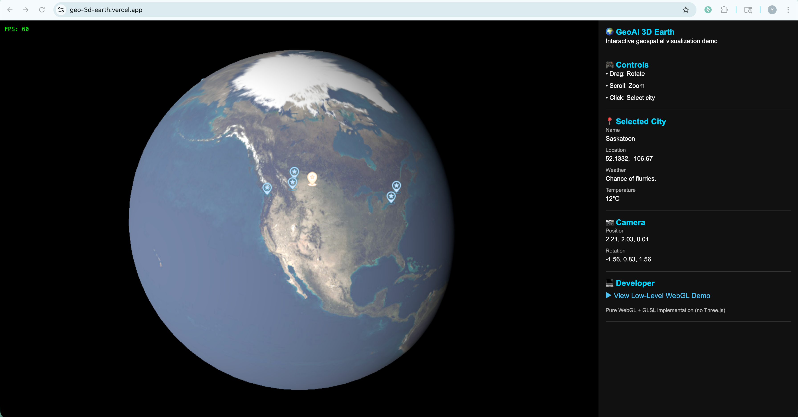
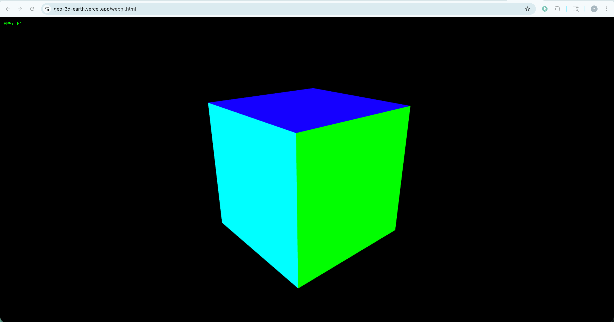

# geo-3d-earth

A multi-page 3D graphics demo built with both **Three.js** and raw **WebGL**, showcasing the same rendering domain at two different levels of abstraction.

- The **Three.js** page renders an interactive 3D Earth globe with city markers, textures, and camera controls.
- The **WebGL** page implements the same graphics pipeline from scratch — custom GLSL shaders, matrix math, and manual draw calls — to demonstrate what Three.js abstracts away.

This project reflects a practical understanding of both high-level 3D application development and the underlying GPU rendering pipeline.

---

## Demo Pages

### `index.html` — Three.js Interactive Earth

A fully interactive 3D Earth globe.

**Features:**
- Earth sphere rendered with a 2048px NASA texture map
- Automatic slow rotation around the Y-axis
- Camera orbit, zoom, and damping via `OrbitControls`
- 20+ city markers placed at real geographic coordinates (lat/lon → Cartesian)
- Click a marker to select a city and view its name, coordinates, weather, and temperature
- Real-time UI panel showing FPS, camera position/rotation, and selected city details
- Link to the WebGL demo page

**Screenshot:**



---

### `webgl.html` — Raw WebGL Cube

A colored 3D cube rendered entirely with bare WebGL — no abstraction libraries.

**Features:**
- 6-faced cube, each face a distinct color (red, green, blue, yellow, cyan, magenta)
- Custom GLSL vertex and fragment shaders written inline
- MVP matrix pipeline (Model × View × Projection) computed manually using `gl-matrix`
- Mouse-drag to rotate the camera (spherical theta/phi coordinates)
- Scroll to zoom (radius clamped to 2–10 units)
- Depth testing enabled for correct face ordering
- Real-time FPS counter

**Screenshot:**



---

## Tech Stack

| Layer | Technology |
|---|---|
| High-level 3D | [Three.js](https://threejs.org/) v0.183 |
| Low-level rendering | WebGL 1.0 |
| Shader language | GLSL ES |
| Matrix math | [gl-matrix](https://glmatrix.net/) v3.4 (CDN) |
| Geospatial data | GeoJSON / lat-lon to Cartesian conversion |
| Build tool | [Vite](https://vitejs.dev/) v8 |

---

## Project Structure

```
geo-3d-earth/
├── index.html          # Three.js demo entry
├── webgl.html          # WebGL demo entry
├── vite.config.js      # Multi-page Vite build config
├── package.json
│
├── js/
│   ├── main.js         # Three.js scene: earth, markers, controls, UI
│   ├── webgl.js        # WebGL render loop: shaders, buffers, matrix pipeline
│   ├── cube.js         # Cube vertex positions, indices, and per-face colors
│   ├── math.js         # lat/lon → 3D Cartesian coordinate conversion
│   ├── cities.js       # City data: name, coordinates, weather, temperature
│   └── fps.js          # FPS counter utility
│
├── css/
│   ├── reset.css
│   └── styles.css
│
├── public/
│   └── img/
│       ├── earth_atmos_2048.jpg   # Earth texture
│       ├── marker.png             # City marker sprite
│       └── marker-sel.png         # Selected city marker sprite
│
└── screenshots/
    ├── threejs.jpg
    └── webgl.jpg
```

---

## Key Concepts Demonstrated

**Three.js page:**
- Scene graph and parent-child transforms (city sprites inherit earth's rotation)
- Texture loading and `MeshPhongMaterial` shading
- `Raycaster` for mouse-based object picking
- `Sprite` rendering for 2D markers in 3D space
- `OrbitControls` with inertia damping

**WebGL page:**
- Vertex buffer objects (VBOs) and index buffers
- Vertex and fragment shader compilation and linking
- Uniform/attribute binding and per-frame updates
- Perspective projection, view (lookAt), and model matrices composed into MVP
- Spherical coordinate camera rig driven by mouse input

---

## Getting Started

### Install dependencies

```bash
npm install
```

### Run development server

```bash
npx vite
```

Then open:
- `http://localhost:5173/` — Three.js Earth demo
- `http://localhost:5173/webgl.html` — WebGL Cube demo

### Build for production

```bash
npx vite build
```

Both pages are built as separate entry points via `vite.config.js`.
